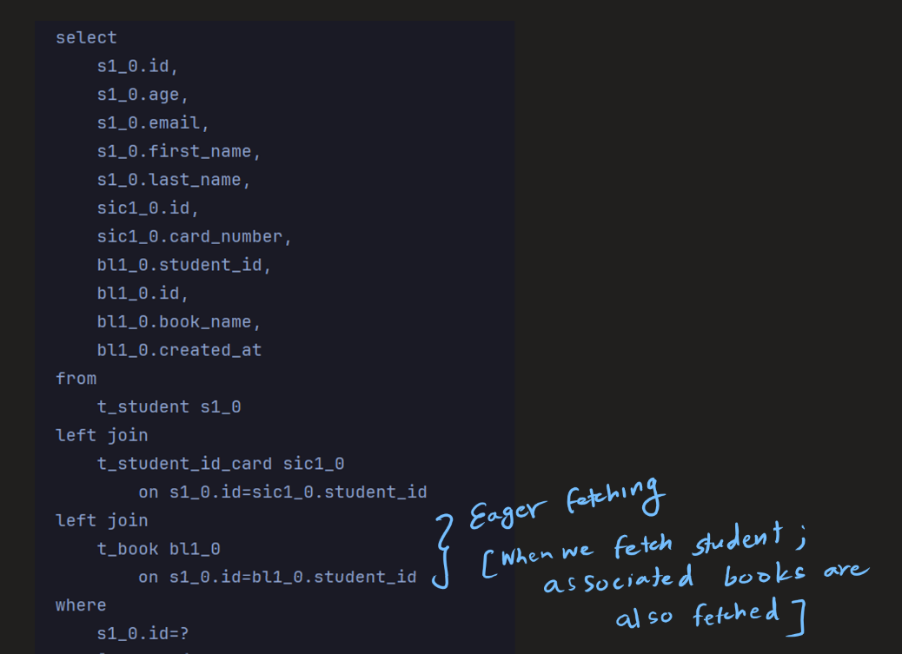

### LAZY VS EAGER FETCHING

**Lazy Fetching**

* Lazy fetching is the default fetch strategy for @OneToMany and @ManyToMany relationships in JPA. With lazy fetching,
  the associated entities (e.g., books in the case of a Student entity) are not loaded from the database until they are
  explicitly accessed. This means that when you fetch a Student entity, the associated Book entities are not loaded
  until you try to access the bookList collection.
* Lazy fetching can be beneficial when you have large collections or when you don't always need to load the associated
  entities. It can improve performance by reducing the amount of data transferred from the database.  

**Eager Fetching**
* Eager fetching is the default fetch strategy for @OneToOne and @ManyToOne relationships in JPA. With eager fetching,
  the associated entities are loaded from the database along with the parent entity. For example, when you fetch a
  Student entity, the associated StudentIdCard entity will be loaded automatically.
